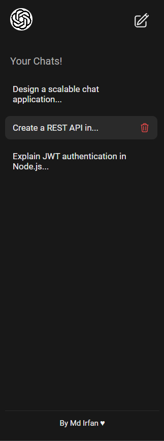
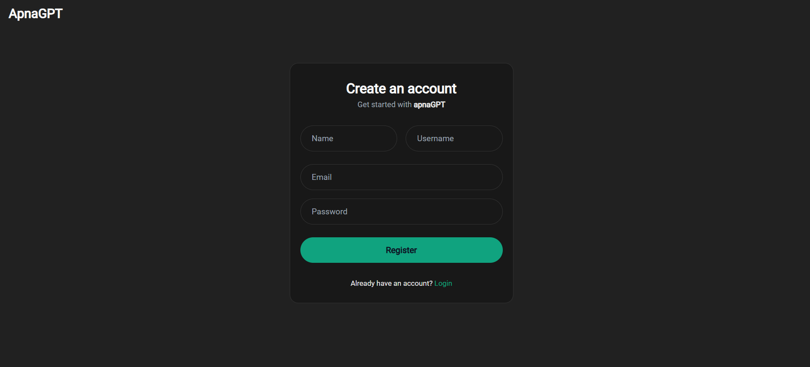

# 🤖 ApnaGPT

A full-stack AI-powered chat application inspired by ChatGPT.

ApnaGPT allows users to create accounts, manage conversation threads, interact with an AI model, and securely store chat history — built with a scalable and production-ready architecture.

---

## 📸 Screenshots

### 🧠 Chat Interface


### 📂 Thread History (Sidebar)



### 🔐 Authentication



---

## 🌐 Live Demo

Frontend:  
https://apna-gpt-pink.vercel.app/

Backend API:  
https://apnagpt-yk3p.onrender.com

---

## 🚀 Features

### 🔐 Authentication

- JWT-based authentication
- Protected routes
- Centralized authentication middleware
- Token validation via middleware (no token in body/query)

---

### 💬 AI Chat System

- Create new chat threads
- Continue previous conversations
- Word-by-word animated AI replies
- Persistent thread history (MongoDB)
- Auto-scroll to latest message

---

### 🗂 Thread Management

- Fetch user-specific threads
- Delete threads
- Sort threads by last updated
- Mobile responsive sidebar

---

### ⚙️ Backend Architecture

- Custom `AppError` class
- Global error handling middleware
- `asyncHandler` wrapper (no repetitive try-catch)
- Clean MVC structure
- Thread ownership validation
- Secure API responses

---

## 🛠 Tech Stack

### Backend

- Node.js
- Express.js
- MongoDB (Mongoose)
- JWT Authentication
- OpenAI API
- Custom Error Handling
- Async Handler Utility

### Frontend

- React
- Context API
- Axios (with interceptors)
- React Router
- CSS Modules
- React Markdown + Syntax Highlighting

---

## 🧱 Backend Project Structure

backend/
│
├── controllers/
│ ├── chat.controller.js
│ ├── user.controller.js
│
├── middleware/
│ ├── auth.middleware.js
│
├── models/
│ ├── User.model.js
│ ├── Thread.model.js
│
├── utils/
│ ├── openAi.utils.js
│ ├── appError.js
│ ├── asyncHandler.js
│
├── routes/
│ ├── chat.routes.js
│
├── server.js
└── .env

---

## 🔐 Security Highlights

- JWT-based protected routes
- Centralized authentication middleware
- No token in request body
- Structured error handling
- Proper HTTP status codes
- Production-ready backend flow

---

## ⚙️ Environment Variables

Create a `.env` file inside backend root:

```env
PORT=5000
MONGO_URL=your_mongodb_connection_string
JWT_SECRET_KEY=your_secret_key
OPENAI_API_KEY=your_openai_api_key
FRONTEND_URL=http://localhost:5173
```

## ▶️ Run Locally

Backend:

```Backend

cd backend
npm install
npm run dev
```

Frontend:

```Frontend

cd frontend
npm install
npm run dev
```

👨‍💻 Author

Built with ❤️ by Md Irfan
